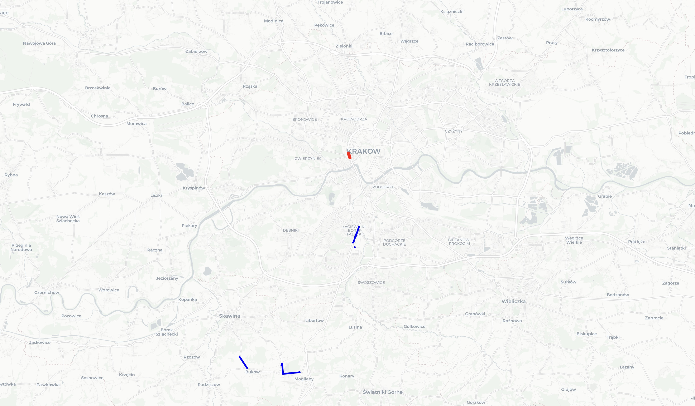
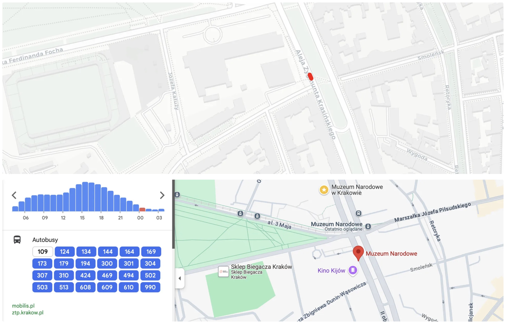
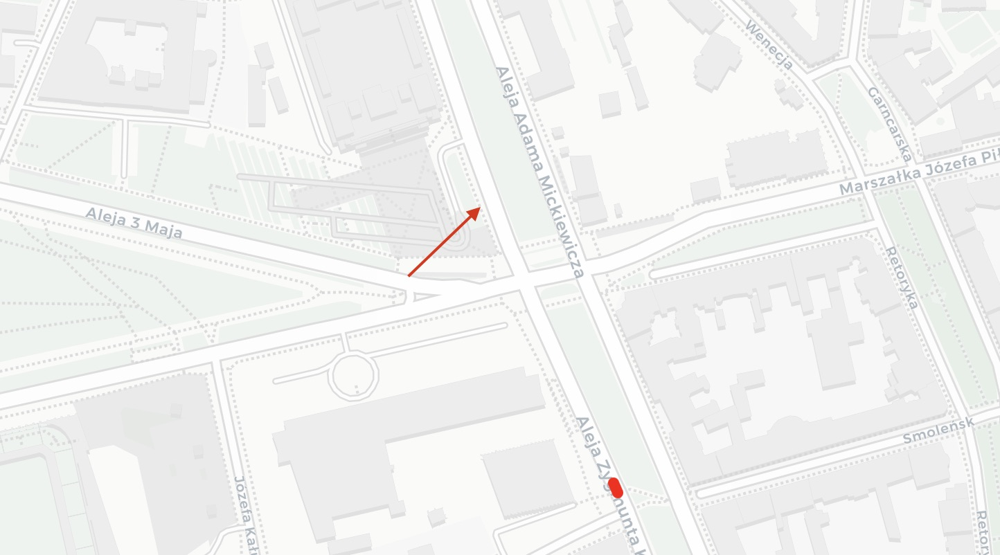
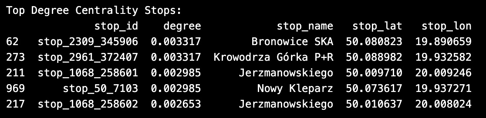
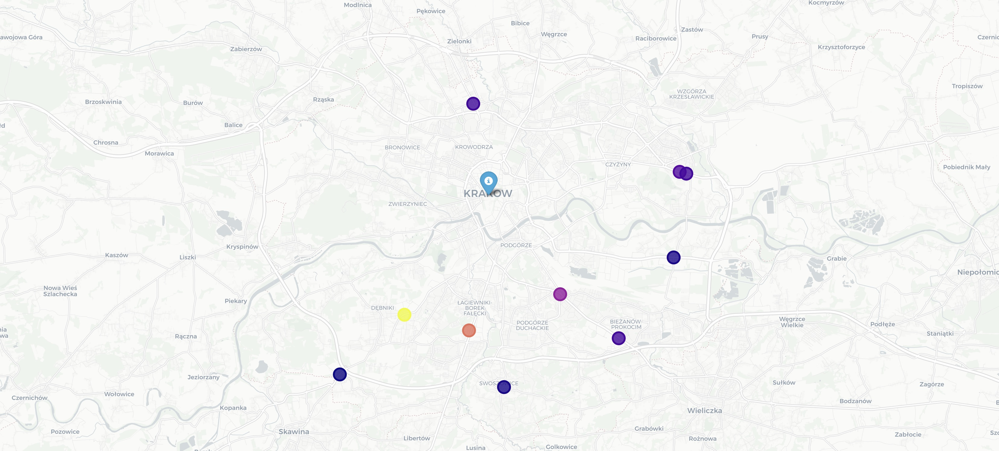

# Unraveling Krakow's Transport Network: Identifying Critical Infrastructure Flaws

## **Abstract**

Krakow's public transport system—a complex web of buses, trams, and roads—demands rigorous analysis for efficient urban planning. By combining GTFS (transit bus schedules) and OSM (street network) data, we can identify critical infrastructure nodes and optimize city mobility.

## **1. Load and Prepare GTFS Data**

Load all relevant GTFS files (shapes, stops, trips, routes, stop_times, calendar, calendar_dates) into pandas DataFrames for further analysis.

Each file describes a different aspect of the public transport system (e.g., stops, routes, schedules).

Data is loaded into a dictionary for easy access. It is up to May, 2025.

### **1.1 What is GTFS?**

GTFS stands for General Transit Feed Specification. It is a standardized, open format for sharing public transportation schedules, routes, and geographic information, making it possible to build apps, maps, and analyses for transit systems anywhere in the world. 

### **1.2 What’s in a GTFS Feed?**

A GTFS feed is a collection of TXT files (usually zipped together) that describe a transit system.

| File Name | Description | Example |
| --- | --- | --- |
| **stops.txt**  | List of all stops/stations with names and coordinates |  |
| **routes.txt** | All transit routes (e.g., bus lines, tram lines) | Bus 10 |
| **trips.txt** | Individual trips (a single run of a vehicle on a route) | Bus 10 at 8:00, 8:30, etc. |
| **stop_times.txt** | Times when each trip visits each stop |  |
| **shapes.txt** | Geographic paths for trips (for mapping routes) | Gives the path the Bus follows on the map. |
| **calendar.txt** | Service schedules (which days each service runs) |  |
| **calendar_dates.txt** | Exceptions to the regular schedule (e.g., holidays) |  |

### 1.3 Are the shapes = roads?

Not exactly. Shapes are not roads themselves.

Shape - the full path a vehicle takes for a trip (could be many roads combined)

Road - a physical street or segment (could be used by many shapes)

## **2. Analyze Transit Operations**

To understand the frequency and distribution of public transport trips we need:

1. Group trips by route and direction.
2. Visualize the number of trips per route/direction using a horizontal bar chart.

This highlights the busiest routes and directions, helping to identify where most public transport activity occurs. Those trips are likely the most important or busiest lines in the network.

It is possible to analyze only one direction of the root (direction is usually 0 and 1, clockwise/counterclockwise), but for a complete and realistic analysis, we should include both directions. 

For example, with some routes we can notice a little difference, it may indicate a special service pattern (e.g., more trips in the morning in one direction).

Route 606 has 459 trips in direction 0 and 457 in direction 1, indicating very frequent service.

The top 5 busiest routs are:

In the output, the trip_id column does not represent a unique trip identifier.

Instead, it is the count of trips for each combination of route_id and direction_id

- **route_id**: The route number.
- **direction_id**: 0 or 1 (outbound/inbound).
- **trip_id**: How many trips (rows in trips.txt) exist for that route and direction.
- **route_direction**: A string combining route and direction for labeling.

## **3. Preprocess Route Shapes**

Convert GTFS shape points into line segments representing the actual paths of transit buses.

1. For each shape, creates segments between consecutive points.
2. Stores each segment’s start and end coordinates.

This step is necessary to later analyze how often each segment is used and to integrate with the street network.

### 3.1 The difference between the input and the output

Let’s talk about difference between the input (shapes_df) and the output (segments_df) in our preprocess_shapes function.

**TLDR**:

Before: Each row = a single point.

After: Each row = a segment (line) between two consecutive points.

**Before**: gtfs['shapes'] (GTFS shapes.txt):

Each row represents one point along a transit route shape:

- **shape_id**: Route shape identifier
- **shape_pt_lat**, **shape_pt_lon**: Latitude/longitude of the point
- **shape_pt_sequence**: The order of the point along the shape

**What is “the order of the point along the shape”?**

The shape_pt_sequence ****tells us the position of each point in the route’s path, from start to end.

- The first point in the shape has shape_pt_sequence = 1.
- The second point has shape_pt_sequence = 2.
- And so on, until the last point.

It defines the exact path the vehicle follows, in order, as a sequence of latitude/longitude points.

If we connect the points in order of shape_pt_sequence, we get the full route line on the map. That’s the point of the preprocessing the shape data.

**After**: segments_df (Output of preprocess_shapes)

Each row represents a segment (a line) between two consecutive points along the shape:

- **shape_id**: Route shape identifier
- **start_lat**, **start_lng**: Coordinates of the segment's start point
- **seq**: Sequence number (from the start point)
- **end_lat**, **end_lng**: Coordinates of the segment's end point

## **4. Calculate Segment Utilization**

We divide routes into segments and count segment utilization to understand which specific parts of the transport network are most heavily used, not just the endpoints (stops).

### 4.1 Is it necessary to?

We can identify the busiest stretches of the network, not just the busiest stops. It helps reveal bottlenecks or critical links that are used by many routes/trips. Summing trips per segment (even if a segment appears in multiple shapes/routes) gives a granular view of network load and redundancy. 

### **4.2 What is a "segment"?**

In our analysis, a segment is a straight line between two consecutive GTFS shape points (usually between stops, but sometimes between intermediate points).

On a map, it represents a small piece of a route—often corresponding to a stretch of road or a trace.

### 4.3 Shapes and Segments are the same thing?

A shape is the entire path a vehicle takes for a trip or route pattern. It’s a sequence of latitude/longitude points, tracing the full journey from start to end.

A segment is a small piece of a shape—specifically, the straight line between two consecutive points in the shape. If a shape has 100 points, it will have 99 segments, each representing a tiny stretch of the route (like from one intersection to the next).

**Why do we care?**

- Segments let us analyze which exact stretches of road are most used, even if many shapes (routes) overlap on the same segment.
- Shapes tell us the overall route patterns, but segments let us zoom in to the busiest or most critical pieces of the network.

### 4.4 Does the Segment explain the data in the same way as Centrality Measurements?

Summing trips per segment and centrality measurements are related but capture different aspects of the network.

**TLDR**:

Segment sums = actual load (how much a segment is used).

Centrality = potential impact (how important a segment/node is for keeping the network connected or efficient).

**Summing Trips per Segment**

The actual usage of each physical segment—how many scheduled trips (buses/trams) traverse that segment per day.

High values = segments with heavy traffic (potential bottlenecks or critical corridors).

Purely based on the schedule data; does not consider the network structure beyond direct usage.

**Centrality Measurements**

The structural importance of nodes or edges in the network graph, regardless of actual trip counts.

High centrality = nodes/edges that are structurally critical for connectivity, even if not the most heavily used.

Considers the entire network topology—not just direct usage, but also how a segment or node connects the system.

High trip count but low centrality (e.g., a busy branch line).

Low trip count but high centrality (e.g., a bridge or transfer node that is the only connection between two areas).

### 4.5 Segment Analysis

Let’s analyze ****how many trips per day use each unique route segment:

- For each shape_id, counts how many trips use that shape (i.e., how many times that route pattern is scheduled).
- Attaches the trip count to every segment belonging to that shape. Now each segment knows how many trips use its shape.
- If a segment appears in multiple shapes, sums the trip counts across all shapes it appears in.

**Left side (low trip counts, high segment count):**

Most segments are used infrequently—these are peripheral or less important parts of the network.

**Right side (high trip counts, low segment count):**

 ****A small number of segments are used by many trips—these are our **core corridors** or bottlenecks.

**Summary Statistics**

- **Total segments:** 86,460
- **Average trips per segment:** ~267
- **Most used segment:** 4,684 trips/day
- **Least used segment:** 1 trip/day

### **4.6 Top 20 Busiest and Least Used Segments**

To get the one most busiest segment is not that useful as to get a bunch of them. It’s often that one line could be very short that looks like a dot on the map. In order to get a road-look-alike map, we are checking the top 20 values form the data frame.

Busiest segments are in red and the least used segments in blue.

Red lines likely represent the busiest corridors in the network, possibly central downtown sections or main transfer routes.

The blue lines represent outlying branches, rarely served areas, or special/express routes.

These top segments (defined by their start/end coordinates) are traversed by the most trips per day—up to 4,684. The least ones are only used by 1 or 2 trips per day. Even though we can see the top 20 of roads, the intensity of the red is bigger than the blue, which tells us about importance of the traffic in this location.

The busiest road in Cracow (Kraków) is Aleja Adama Mickiewicza on both ways. Mostly two lines on the crosses with Aleja Marszalka Ferdinanda Focha (pl: Aleja Marszałka Ferdinanda Focha). 

The list one with 2 trips are Zakopianska (pl: Zakopiańska) and Armatury, but with 1 trip the streets are Dluga (pl: Długa) and Skawinska (pl: Skawińska). 

Analyzing this we know that we need to focus on red segments with high trip counts for upgrades, maintenance, or priority lanes. 

The blue segments with low trip counts may be candidates for service changes(pits) or further study(increased migration from the location and empty villages).

### 4.7 Comprehensive analysis of the busiest segment

Can we find which lines are responsible for the heavy traffic on that segment? Yes, we do. Let’s have a look at the most busiest segments. 

We can notice that it has around 4684 trips.

But the segment can be part of many different routes (in our case several bus lines might share the same street downtown).

To see which lines use this segment, we:

1. Find all the route shapes (shape_id - the precise path that a vehicle follows along a route) that include this segment. 
    
    
    
2. Find all the trips that follow those shapes.
3. Look up which bus lines (route_id) those trips belong to.
    
    
    
4. Print unique route_id values from 4684 rows to identify routs themselves.
    
    
    

Those values like 'route_602', 'route_580', etc., are route IDs from our GTFS data, but they are not always the same as the public-facing bus line numbers.

In GTFS, the route_id is often an internal identifier. The actual bus line number is usually found in the route_short_name column of the routes.txt file.

To get the real bus line numbers for our segment, we should join our route_id values with the routes DataFrame and look at route_short_name.

For the comparison let’s take two bus stations that are very close to our segment and have a look at the buses.  

Buses that are on the Google Maps, but not in the busiest segment: [990, 610, 109]: 

- Bus 990:This night bus route runs through Muzeum Narodowe, but operating only at night and serving suburban and rural areas, it does not affect peak daytime traffic in the city's busiest segments.
- Bus 610: The bus is not included in the list of routes traversing Kraków's busiest segment due to its operation during nighttime hours, when passenger traffic is significantly lower compared to daytime.
- Bus 109: Operating between Bielany and Cracovia Stadion. The average interval between buses is 51 mins and its route focuses on connecting these outer districts to the city. Due to the rare passing through the road, it could not appear in the busiest segment.

We are successfully translating internal GTFS route IDs into real-world bus line numbers for the busiest segment in Krakow’s transport network. This is essential for interpreting our analysis in a way that matches what passengers and planners see on the street.

### 4.8 Observations and Solutions:

Once we’ve identified the busiest segment in the public transport network, there are several ways to optimize it, depending on the context and constraints. Here are some practical strategies:

1. Improve Scheduling : Adjust schedules to avoid vehicle bunching and spread demand more evenly. Use real-time data to adapt service frequency during peak times - The digital boards come in handy. 
2. Traffic managing system: Space out buses more evenly to avoid bunching. It is possible to create an AI system that will control all the busses scheduling and report to some busses to wait for more minutes on some stations to prevent the further traffic on the roads ahead. Also let buses get green lights at intersections to keep them moving.
3. Rethink the bus paths: Reduce the number of lines using the same segment, or create express/skip-stop services that bypass the busiest stretch.
4. We can observe that the infrastructure in Kraków already got some upgrades. One of the solutions was to create bus-only lanes to reduce delays from mixed traffic. And looking at the top 20 segments on real map they really did improve this part. 
    
    
    
    
    
    But going further we notice that the road stops being bus-only, and the line is a complete intersection for all types of the vehicles that need to turn right. That explains the top1 busiest segment of the city Kraków. 
    
    
    
    5. Passenger communication: Inform passengers about less crowded routes or segments that take a few minutes more but significantly decrease the demand on the route during traffic.
    

## **5. Bus lines  Network Graph, Centrality measures and Visualization**

We construct a directed graph where nodes are stops and edges represent direct connections between stops (based on trip sequences).

This directed graph of public transport stops, where:

- Nodes = stops
- Edges = direct connections between consecutive stops on a trip
- Edge weights = how many trips per day use each connection

This turns our GTFS stop and trip data into a powerful network graph for transit analysis, enabling us to find the most important stops and connections in the system.

We can already visualize the graph that has stop coordinates from stops_df for mapping, the edges as red lines, up to max_edges, and nodes as black circles.

After the build we calculate centrality measures:

Eigenvector centrality, PageRank, Betweenness centrality and Degree centrality

### 5.1 **Eigenvector Centrality**

Not just the number of connections, but the *quality* of those connections. If a stop is linked to other highly-used or central stops, its score is higher. Identifies influential hubs in the network.

**Top stop: Kamieńskiego**

This stop is not only well-connected, but it is also connected to other highly important stops. Other high eigenvector stops: Rondo Matecznego, Rondo Grunwaldzkie, Kamieńskiego Wiadukt, Ludwinów. These are likely major transfer points or hubs in the network.

### 5.2 **PageRank** Centrality

A stop is important if many trips pass through it, especially if those trips come from other important stops. Highlights stops that are likely to be traversed by many passengers, even if they aren’t the most connected. A-la with high “traffic” potential.

**Top stop:** Muzeum Narodowe (National Museum), which is the same according our segment analysis.

These stops are likely to be traversed by many trips, even if they aren’t the most directly connected. 

**Other high PageRank stops:** Skawina Cmentarz, Rondo Ofiar Katynia, Jubilat, Bronowice SKA. These may be important for through-travel or as part of many routes.

### **5.3 Betweenness Centrality**

Measures how often a stop lies on the shortest path between other stops. High betweenness = the stop is a key transfer or bottleneck point. It usually identifies critical transfer points or potential single points of failure.

**Top stop:** Teatr Słowackiego

This stop is a key transfer or bottleneck point—many shortest paths between other stops pass through here.

**Other high betweenness stops:** Starowiślna, Poczta Główna, Teatr Słowackiego(odwrotny przystanek), Poczta Główna (odwrotny przystanek). These are likely critical for network connectivity; disruptions here would affect many routes.

### 5.4 **Degree Centrality**

The number of direct connections a stop has to other stops. High degree = many routes or lines pass through or connect at this stop. Finds the most directly connected stops (e.g., major stations or intersections).

**Top stop:** Bronowice SKA, Krowodrza Górka P+R

These stops have the most direct connections to other stops (many lines or branches).

Other high degree stops: Jerzmanowskiego, Nowy Kleparz, Jerzmanowskiego. These are likely major intersections or termini.

## **6. Integrate OSM Street Data**

Let’s get Krakow’s drivable street network and convert it to GeoDataFrames

OSM stands for OpenStreetMap.

It is a free, collaborative project that creates a detailed map of the world, built by a community of volunteers who contribute and maintain data about roads, buildings, natural features, including detailed street networks for cities like Kraków.

And to access the OpenStreetMap in Python, we will use the OSMnx - library that makes it easy to download, analyze, and visualize street networks from OSM.

First we converts the graph to two GeoDataFrames:

- osm_nodes: Each row is a street intersection or endpoint, with coordinates and attributes.
- osm_edges: Each row is a street segment, with geometry and road type.

OSM data consists of 9620 nodes, 21168 edges. Simple visualization will help us to understand the graph better.

### 6.1 What’s the difference between GeoDataFrames and DataFrame from pandas?

A GeoDataFrame (from the geopandas library) extends the pandas DataFrame to handle geospatial data. 

GeoDataFrames support spatial operations (e.g., distance, intersection, buffering, spatial joins) that are not available in standard DataFrames.

GeoDataFrames track the Coordinate Reference System (CRS), allowing for projections and transformations between coordinate systems.

## **7. Multimodal Network:** GTFS + OSM

Next step is to create a multimodal transport network graph for Krakow.

The multimodal network as an ultimate graph that connects everything together. We get the full picture of how people and vehicles move around Kraków, whether they’re driving or taking public transport. It will help us make smarter decisions. When we analyze things like centrality or bottlenecks on this full network, our results are much more realistic and useful for city planning.

The nodes are with different colors for each data type. 

- Red dots for [BUS] nodes - bus segment endpoints
- Blue dots for [ROAD] nodes - road intersections

Comparing the map above with GSTM Bus Graph map we can see how the merging with OSM enhances the connections between nodes providing more detailed map.

### 7.1 What did we do with repetitive nodes?

The integrated network has 54224 nodes, 75207 edges. It’s an enormous graph to calculate Betweenness Centrality. That why we added an option to merges close nodes. 

The algorithm _merge_close_nodes_ integrates two complementary data structures: a kd-tree and a union-join (also known as union-find). The kd-tree is employed to efficiently identify pairs of spatially close nodes by organizing them in a multi-dimensional space, enabling fast range and nearest-neighbor queries. Once such close pairs are identified, the union-join structure is used to progressively merge them into larger clusters or connected components. This combination allows the algorithm to both detect proximity relationships and maintain a dynamic grouping of nodes, ultimately merging all sufficiently close nodes into cohesive groups.

If *merge_close_nodes=True,* nodes that are spatially very close (within *distance_threshold*) are merged, reducing redundancy at intersections where bus and road nodes nearly overlap. 

GTFS bus segment endpoints and OSM road intersections may not align perfectly due to data precision, but merging helps create a more realistic, connected multimodal network.

After merging close nodes our Multimodal Network Graph consists of 15958 nodes, 35397 edges.

### 7.2 What about Bus Segments and Directionality?

Bus segments are added as directed edges from start_node to end_node. If our GTFS data at the very beginning would include only one direction (e.g., direction_id==1), then bus edges will only go one way in the graph. But for the best results our graph includes both directions in our segment_day_trips and we will get edges in both directions (A→B and B→A), making the bus network bidirectional.

Bidirectional bus network does allow us to analyze the interaction between road and public transport networks more precisely. For example, to find critical nodes, simulate disruptions, or optimize infrastructure.

## **8. Assign Flow Capacities**

The capacity dictionary defines typical daily vehicle flow capacities for different types of roads, based on their classification in OpenStreetMap (OSM).

Assign a flow capacity to each edge, representing its maximum throughput.

- For road edges, it uses typical daily vehicle capacities based on the road type (e.g., motorway, primary, residential).
- For bus edges, it estimates capacity as the number of bus trips (arrivals) times an assumed bus capacity (here, 50 people per bus).
- If the edge type is unknown, it assigns a default capacity of 1,000.

Flow capacities are used as weights in centrality calculations, reflecting the relative importance of each link.

The values are **estimates of how many vehicles per day** each road type can handle:

| **Road Type** | **Vehicles/Day** | **Description** |
| --- | --- | --- |
| Motorway | 180,000 | Major highways, highest capacity |
| Trunk | 138,000 | Major roads, just below motorway |
| Primary | 53,000 | Main roads connecting cities or large districts |
| Secondary | 23,000 | Important roads, but less than primary |
| Tertiary | 5,300 | Smaller connecting roads |
| Unclassified | 12,300 | Roads that don't fit other categories |
| Residential | 4,000 | Streets in residential areas |
| Service | 750 | Access roads, parking, alleys, etc. |
| Living Street | 1,000 | Streets designed for pedestrians and low-speed traffic |
| Motorway_link
Trunk_link
Primary_link
Secondary_link
Tertiary_link | Varies | Lower capacities for on/off ramps and connectors |
| Bus | None | Capacity based on number of bus trips |
| Unknown | 1, 000 | Default capacity |

Each road type has its own color. The color grading goes down as the Capacity Values are decreasing.

### 8.1 Can we calculate the **Centrality measures without the Flow capacities?**

Yes, but if we skip the flow capacity assignment, NetworkX will just use the default edge weights (which are typically 1 for all edges).

However, with assigning flow capacities the centrality reflects not just the structure of the network, but also the “importance” or “capacity” of each connection (e.g., a motorway or a busy bus line counts more than a small street).

But without flow capacities, all edges are treated equally, so a tiny residential road is as “important” as a motorway or a major bus corridor.

To make our analysis much more meaningful for real-world planning we decide to do add this little step. 

### 8.2 Why haven't we assigned the flow capacities to Public Transport dataset to make our analysis “more meaningful”?

When we built the stop-to-stop network, the main thing we cared about was how many trips go between stops (the “weight” of the edge). That already reflects how busy each connection is, so we didn’t need to add another “capacity” value.

At that point, we were only looking at public transport, not mixing it with roads. There’s no “road size” or car traffic to consider, so assigning a capacity like we do for streets doesn’t make sense.

For pure transit networks, the number of trips (from GTFS) is the most relevant “weight.” That’s what we used for centrality, and it works well for understanding which stops and connections are most important for public transport.

But when we move to the multimodal network, mixing roads and buses, we want to compare apples to apples. That’s why we assign flow capacities—so a busy bus line and a busy road can be compared in the same analysis.

### 8.3 Aleja Adama Mickiewicza Flow Capacity

By typing on the road we can see the capacity. For instance we take our well known road on Aleja Adama Mickiewicza.

The high value for Capacity: 88200.0 on a Type: bus edge comes from how we previously assign flow capacities to bus segments in our function.

Bus capacity = trips × assumed capacity per bus (each bus can carry 50 people by mean: busy morning/evening, loose afternoons and nights)

So, if a segment has 1,764 arrivals per day (which is possible for a very busy corridor, and only one way as we can see), the calculation is: 1,764 trips × 50 = 88,200 people could be transported per day.

As another example of the connections, the same primary road capacity is around 53000 and it appears to be the only primary road in the center of the city.

## 9. Multimodal **Centrality measures**

Our plan is to identify the most critical nodes in the entire urban mobility system (roads + buses).

Recalculate Eigenvector Centrality, PageRank, Betweenness, and Degree Centrality for the integrated network, using flow capacity as the weight.

### 9.1 Eigenvector Centrality

Identifies nodes (bus stops/intersections) that are connected to other highly connected nodes. These are the “core hubs” of the network.

Eigenvector centrality on our multimodal network (where edge weights = flow capacity) is prioritizing nodes connected to high-capacity roads (e.g., motorways), because those edges have much higher weights than bus segments.

Our [BUS] nodes do have low centrality, because bus edge capacities (trips × 50) are much smaller than road capacities (e.g., 180,000 for a motorway).

As a result the centrality map will highlight the car road backbone, not the public transport structure.

Let’s create "Super-Hub" Corridors excluding trunk and motorway roads, and using the top multimodal eigenvector centrality nodes (regardless of whether they are bus or road nodes).

We’ve created a copy of our integrated (multimodal) network and remove all edges where the road type is 'trunk' or 'motorway'. 

On this filtered network, we recalculate eigenvector centrality for all nodes, using the flow_capacity as the edge weight. This tells us which nodes are most "influential" in the network without trunk/motorway roads.

The visualized filtered network consists of:

- Edges are colored by their road type.
- Nodes are colored and sized by their eigenvector centrality.

**Super-hub corridors**

We’ve select the top 5 nodes by eigenvector centrality in the filtered network and visualized them as "super-hubs", drawing lines between each pair to show potential high-priority corridors.

It looks like our top 5 nodes are all located on the same road. This is a common outcome in network analysis when a single corridor becomes the main backbone after removing higher-capacity roads — centrality "clusters" on the most important remaining route.

There are a few confusions we can make:

- The remaining road is now the most critical for network connectivity and flow.
- If this corridor is disrupted, the network’s efficiency drops sharply.
- Our super-hub analysis is highlighting a single, dominant alternative corridor.

But the most interesting thing that are the points 2 and 3 are the two ends of a bridge on the most critical remaining corridor. This has strong implications for network resilience and urban planning. 

Conclusion: **The bridge itself is a critical bottleneck!**

If it is disrupted (e.g., due to maintenance, accident, or natural disaster), the entire corridor—and possibly the city’s connectivity—could be severely impacted.

The city should prioritize planning and constructing alternative crossings (e.g., additional bridges or tunnels) to reduce dependency on this single structure.

Another solution is to encourage development and transit options that reduce over-reliance on this corridor. 

**Simulating the impact of maintenance of this bottleneck**

Overall Eigenvector centrality is useful for identifying nodes that are well-connected to other well-connected nodes, but it is not the best measure for simulating the impact of maintenance or node/edge removal—especially in transport networks.

Better alternatives for maintenance/disruption scenarios are Betweenness centrality and Edge betweenness centrality.

First one measures how often a node/edge lies on the shortest paths between other nodes. Removing high-betweenness nodes/edges is more likely to fragment the network or force long detours.

The edge betweenness centrality is especially useful for identifying critical links (e.g., bridges, corridors) whose removal would disrupt flow. We will try recreate this on those centralities. 

### 9.2 PageRank Centrality

Highlights nodes that are likely to be reached by many random journeys—“most visited” or “most likely to be passed through.”

Most of the highlighted notes happened to be an intersection nodes. 

Now let’s have a loot at the 10 nodes with the highest PageRank scores, which are likely to be reached by many random journeys .

These are the most critical points for the flow of people and vehicles in Krakow’s combined road and public transport system.

**First/Last Mile Analysis**

First/Last Mile refers to ways of helping people get from their starting point to the nearest transit stop (first mile), and from their final transit stop to their actual destination (last mile). These are often the weakest links in public transport, especially in suburbs or areas far from the city center.

These nodes are significantly far from the city center (all over 7 km, with one nearly 9.5 km away). 

Their distance suggests they are on the city’s suburban areas serving as key transfer locations for people traveling between suburbs. 

Because they are far from the center, travelers reaching these nodes may face challenges completing their journey, especially if local public transport, bike/scooter sharing, or taxi options are limited. 

We will try to analyze each one of them from top to the bottom.

**Node [BUS]20.049892,50.069113 at 8.08 km:**

The Klasztorna bus stop (Stop ID: 189-03) is a significant transit point in Kraków, situated approximately 9.5 km from the city center. Its high PageRank indicates its importance within the public transport network.

- Bus Lines: 123, 149, 174, 601, 874
- Tram Lines: 10, 75

These services provide direct links to various parts of the city, including central hubs like Nowy Kleparz and Plac Centralny im. R.Reagana. The stop is located near Mogila Abbey (Opactwo Cystersów w Mogile), a historic Cistercian monastery dating back to the 13th century.  This makes Klasztorna a key access point for both daily commuters and tourists. 

Introduce bike-sharing stations or improve pedestrian pathways to facilitate easier access to and from the stop. Assess and potentially increase the frequency of buses and trams during peak hours to accommodate high demand.

**Node [BUS]20.042654,50.039076 at 7.94 km**

The **Półłanki 01** bus stop (Stop ID: 692-03) is located in the southeastern part of Kraków, within the Bieżanów-Prokocim district, near the intersection of Półłanki and Szparagowa streets. The surrounding area includes residential developments and industrial facilities, making the stop a vital access point for both commuters and local residents

Bus Lines: 123, 125(Dworzec Główny Wschód), 195, 264, 605

These lines provide direct links to key areas, including the city center, residential neighborhoods, and industrial zones

Due to the distance from the main transport hubs, this stop may be less accessible to pedestrians and cyclists. Improving the infrastructure of the first and last mile, such as sidewalks, bicycle paths or bus connections, could increase its accessibility and functionality.

**Node [ROAD]1349546604 at 9.49 km**

The Wrony Bus Stop (ID: 540-02) is located in the southern part of Krakow, in the Swoszowice district, in the area of Wrony Street. This area is characterized by single-family buildings and is far from the main communication arteries. 

Due to the peripheral location, the accessibility of the stop may be limited for people without their own means of transport.

Since May 2025, renovation work has been carried out on Wrony Street, including the reconstruction of the railway crossing and the modernization of the underground infrastructure. Therefore, it is planned to completely close part of the street for about four weeks in July 2025. During this time, a temporary bus loop and stop will be created, which may affect the routes and timetables of the lines serving the Wrony stop

Investments in pedestrian and bicycle infrastructure and better communication with major bus and tram lines could significantly improve its functionality.

**Summary:**

These nodes are critical for people entering or leaving Kraków’s core. Investing in first/last mile solutions here would make the whole network more accessible and attractive, especially for suburban commuters.

### 9.3 Betweenness Centrality

But this time we’ve recalculated the betweenness centrality using the inverse capacity. 

In transport networks, capacity (vehicles/hour) represents how much flow an edge can handle.

Betweenness centrality uses shortest path algorithms and interprets the weight as a "cost" or "distance” where lower is better.

High-capacity edges (like highways or big bridges) should be *easier* to traverse, not harder.

If we use capacity directly as the weight, then the shortest path will avoid high-capacity edges (because the "cost" is high), which is the opposite of reality.

Here’s a visualization of the top 10 betweenness nodes.

**Simulate removal of the critical bridge node**

Let’s simulate the removal of [BUS]19.929274,50.052866, the bridge bottleneck which we’ve been looking at  9.1 Eigenvector centrality and analyze the impact.

When we removed a bridge node, a few more nodes to completely isolate the bridge, shortest paths are recalculated and the last top 10 betweenness nodes completely disappeared. 

The largest component shrinks significantly and some many nodes became disconnected, this confirms the bridge is a single point of failure.

**What is a Single Point of Failure (SPOF)?**

It is a critical component within a system whose failure can cause the entire system to stop functioning. It's essentially the weakest link in a chain, where the failure of that link can disrupt the entire system's operation.

The new Top 10 betweenness confirms previous observations.

This supports your conclusion: the city should prioritize redundancy (new bridges, tunnels, or alternative routes).

### 9.4 Degree Centrality

Counts the number of direct connections—nodes with many links are “most connected.”

Kraków’s network is highly interconnected. Many intersections, stops, or transfer points are directly linked to multiple other nodes (roads, bus, segments, etc.).

Drivers may have more options if one route is blocked, there are likely alternative paths available.

We are visualizing the top 5 most connected nodes (by degree centrality) in your multimodal transport network.

### **9.5 Edge Betweenness Centrality (Roads/Segments)**

Identifies the most critical roads/segments—those that carry the most “shortest paths” and are likely bottlenecks. It measures how many of the shortest paths between all pairs of nodes pass through a given edge. High edge betweenness means the edge is a “bottleneck” or “bridge” in the network—removing it would disrupt many shortest routes.

**What’s the difference between Edge Betweenness and Node Betweenness?**

Node betweenness: Importance of a node as a transfer/interchange point. Used to find critical stops/intersections for resilience, transfer, or disruption planning.

Edge betweenness: Importance of a specific connection/road/segment as a conduit for flows.

**Top 10 Edge Betweenness Analysis**

The presence of both [BUS] and [ROAD] nodes in top edges highlights the importance of seamless transfers between bus and road networks.

A few top edges connect bus segment endpoints to road nodes ([BUS] to [ROAD]), indicating these are key transfer points between segments.

Several edges are between consecutive bus segment nodes ([BUS] to [BUS]) — these are critical bus corridors.

Some edges are between road nodes ( [ROAD ]to [ROAD]) — these are important road links in the multimodal network.

These edges are critical for overall network connectivity. Disruption (e.g., roadworks, accidents, or bus route changes) here would impact many shortest paths.

**Summary:**

The top edge betweenness values highlight the most critical links in Krakow’s multimodal network. These are the “weak links” whose failure would fragment or severely disrupt the network. Prioritize these for resilience and redundancy planning.

## **10. C**ombined Centrality Measure **Node Analysis**

Next we identify and analyze the top critical nodes in the multimodal network by combine all centrality measures into a single DataFrame. After normalization scores and computation we select the top 10 nodes by composite score.

At the end we get the most vulnerable or important locations in the city’s transport system, guiding where interventions would have the greatest impact. 

The plot shows that the top 10 critical nodes in Kraków’s multimodal network are a mix of road intersections and bus stops. This means both types of infrastructure are essential for the city’s overall connectivity and resilience.

6 out of 10 top nodes are road intersections. These are likely key junctions where many routes converge. If disrupted, they could fragment the network or cause major detours.

4 out of 10 are bus stops. These stops are probably major transfer points or endpoints for many routes, making them vital for public transport efficiency.

Nodes with high mean_edge_betweenness are not only important themselves but are also connected to bottleneck links. Their failure could impact both node and edge flow.

Both road intersections(blue) and bus stops(red) in the top 10 should be prioritized for maintenance, monitoring, and contingency planning. If possible, add alternative routes or stops near these nodes to improve resilience.

## Conclusion

We performed a comprehensive analysis of Kraków’s urban transport network by integrating public transport data (GTFS) with street network data (OSM). We constructed a multimodal graph that represents both road intersections and public transport stops as nodes, and both street segments and bus routes as edges. Using advanced network techniques, we calculated multiple centrality measures — including eigenvector, PageRank, betweenness, degree, and edge betweenness — for all nodes and edges in the integrated network.

Our analysis identified the most critical nodes and links in the city’s transport system. The results show that both road intersections and bus stops play vital roles in maintaining network connectivity and resilience. The top critical nodes, determined by a composite of centrality metrics, are a mix of key road junctions and major bus stops — highlighting the importance of both infrastructure types for urban mobility.

We visualized these findings using interactive maps and plots. These insights can inform targeted interventions, such as prioritizing maintenance, improving redundancy, and enhancing emergency preparedness at the most influential points in the network. The methodology and tools developed here provide a robust framework for ongoing transport planning and resilience analysis in Kraków and can be adapted for other cities and multimodal systems.