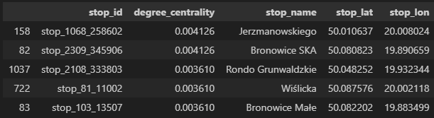

# GTFS Kraków Network Analysis
## Overview
This repository contains network analysis of Kraków's public transportation system using GTFS (General Transit Feed Specification) data. The project applies graph theory concepts to analyze the connectivity and importance of transit stops throughout the city.

### Data
The analysis uses GTFS data from Kraków's public transportation network, including:

Stop information (locations, names)
Routes and trip data
Stop times and sequences

### Key Features
Network Construction: Builds a directed graph representation of the transit network
Centrality Metrics: Calculates eigenvector centrality and PageRank to identify key transit hubs
Geospatial Visualization: Interactive maps showing stop importance and connections
Weight-based Analysis: Considers connection frequency for edge weights
Methodology
The project follows these analytical steps:

### Data preprocessing and filtering
Construction of a directed graph from stop sequences
Calculation of edge weights based on connection frequency
Application of eigenvector centrality and PageRank algorithms
Visualization of results with geographic context
Visualizations
Interactive Maps: Folium-based visualizations with stops colored by importance metrics
Network Graphs: Representations of the transit network showing connections
Geographic Context: All analysis maintains spatial relationships between stops

## Dataset description 

### GTFS public transport 
As was mentioned dataset was constructed in General Transit Feed Specification. It is global standard of public transport data notation, which may contain above 30 differrent files but mandatory is only 6. In our particular case dataset was built from:
- `calendar.txt` - file contains information about timetables variants with dates when it is valid
  - _Example_:
  ```
  service_2,0,0,0,0,0,1,0,20250329,20250627
  ```
  means that timetable named service_2 is valid from 29-03-2025 to 27-06-2025 in Saturndays
- `calendar_dates.txt` - infromation about exceptions from point above
- `stops.txt` - information conencted with stops, like name, position etc
  - _Example_:
  ```
  stop_1_101,2167-01,"Młynka Pętla","01",50.111924166,19.692382222,,,0,,,
  ```
  means that stop with id in dataset=stop_1_101 and operator's id=2167-01 is named Młynka Pętla and located 50.111924166,19.692382222
- `shapes.txt` - information about route's shape, described as ordered set of points
  - _Example_:
  ```
  shape_6254,50.088569,19.931231,1,
  ```
  means that point 50.088569,19.931231 is first point in shape_6254
- `trips.txt` - information which shapes includes particular bus line 
- `routes.txt` - transition from gtfs route id to operator's route 
- `stop_times.txt` - infromation about bus deparutes/arrivals

Such universal structure allows to analize data from different cities indepenently with the same method.

### OSM road data
Data from Open Street Maps was pulled directly as weighted graph, what has nodes in crosses and road are edges. Edges has more than one describing parameters. The most imporants:
- road kind regarding OSM scale:
    1. motorway – highway
    2. trunk – high speed road
    3. primary – main road
    4. secondary 
    5. tertiar
    6. residential 
   
- **lanes**: `int` – number of lines in both side
- **maxspeed**: `int` – speed limit
- **name**: `str` - street's name
- **oneway**: `bool` - true if road is directed

Basing on those information is possible to create relevant metric describing how big traffic should be in this place

## Data visualization
### GTFS public transport
#### Line's frequency


As we can observe there are several bus/tram lines what goes particularly often. It might be good point to start trafic optimalization, because maybe this lines has only few important points and beetwen them routes can be splitted into different lines.


Results are resonable, in city center is the biggest trafic and less in suburbs. 

### OSM road data 


As we can see area covered by road's data is bigger than covered by bus. This images shows data are detailed enough.

### Integrated


As we can see in city center are mostly residential and primary roads. There is only one road classified as motorway.


## Graphs centrality metrics
### GTFS public transport 
#### Eigenvector centrality


As we can see results are intuitive, in city center is the biggest bus traffic in one stop 


After connection with bus frequency we can see that, stops with the biggest centrality are connected with the most used roads.

#### Pagerank:


Pagerank takes into account not only the number of connections but also their importance – how well-connected the neighboring stops are. High values usually appear at transfer hubs surrounded by other significant stops. These can be central interchange points with access to multiple lines.

#### Betweenness centrality


Betweenness centrality measures how often a stop lies on the shortest path between other stops. High values are typical for transit points that connect different areas – often found on the outskirts of the city center or between districts. Such stops serve as key bridges in the network.

#### Degree centrality



Degree centrality counts the number of direct connections a stop has. Stops with high values tend to be local hubs – for example, intersections of many bus lines – but are not necessarily central in the overall network.

### Comparison of centrality measures:

Each measure captures a different aspect of a stop’s importance:

* **Eigenvector centrality** – reflects a stop’s global influence based on the importance of its neighbors; typically highlights central urban stops.
* **Pagerank** – considers both the direction and weight of connections; favors well-integrated stops even outside the absolute center.
* **Betweenness** – identifies strategic connectors that lie on main routes between other stops; key for passenger flow across the network.
* **Degree** – shows local connectivity; many lines mean a high score, but it doesn’t guarantee overall network significance.

Together, these metrics provide a more comprehensive view of the public transport network’s structure.

### Integrated data

#### Eigenvector centrality


In this case, the highest values appear at stops located near highway exits. These stops are well-connected to other important nodes in the network, acting as key access points for regional or intercity traffic entering the urban area. Their high centrality reflects their strategic position in linking major routes with local transit. Also it might cause high traffic, what should be splitted

#### Pagerank


Here, we can observe slightly higher values in the city center compared to other areas. This suggests that central stops are better connected within the overall structure of the network, linking to other important and frequently used stops, which increases their relative importance.

### Beetweness centrality


In this case, the highest values are concentrated right in the city center. This indicates that many shortest paths between other stops pass through these central locations, making them critical transit points for passenger flow across the entire network.

As we can observe each centrality metrics shows differnt things but all of them are reasonble and important.

## GTFS and OSM data integration

### Challanges
In integration step we have been forced to head with several problems:
1. nodes connection - situations when differents nodes is logically the same place (road's cross and bus stop located in the same place)
1. universal metric - how to compare bus people capacity with road ?

### Ideas

1. We can merge nodes located in close groups
2. Make the assumption that in one bus travel can be about 50 people and multiply it by trips per hours. For road search average hour capacity

### Implementation 

#### Vertex merge
In nodes merge we used KDTree structure. It allows to fast and effective searching pairs of nearest nodes. After it we used UnionFind structure to join pairs into groups

```python
def create_merged_graph(graph, distance_threshold=0.0005):
    nodes_coords = pd.DataFrame({
        'node': list(graph.nodes),
        'x': [data['x'] for _, data in graph.nodes(data=True)],
        'y': [data['y'] for _, data in graph.nodes(data=True)]
    })

    tree = cKDTree(nodes_coords[['x', 'y']].values)
    pairs = tree.query_pairs(distance_threshold)

    groups = nx.utils.union_find.UnionFind()
    for pair in pairs:
        node1 = nodes_coords.iloc[pair[0]]['node']
        node2 = nodes_coords.iloc[pair[1]]['node']
        groups.union(node1, node2)

    merged_graph = nx.DiGraph()
    for v, data in graph.nodes(data=True):
        representative = groups[v]
        merged_graph.add_node(representative, **data)

    for u, v, data in graph.edges(data=True):
        merged_graph.add_edge(groups[u], groups[v], **data)

    return merged_graph
```
  
#### Universal capacity
For road we find capacity in Google and after it we assumpt the links has 20% of basic capacity 

```python
capacity = {
    "motorway": 180_000,            
    "trunk": 138_000,               
    "primary": 53_000,              
    "secondary": 23_000,            
    "tertiary": 5_300,              
    "unclassified": 12_300,         
    "residential": 4_000,           
    "service": 750,   
    "living_street":1000,


    "motorway_link": int(250_000 * 0.20),      
    "trunk_link": int(138_000 * 0.20),         
    "primary_link": int(53_000 * 0.20),        
    "secondary_link": int(23_000 * 0.20),      
    "tertiary_link": int(5_300 * 0.20),        
    "unclassified_link": int(12_300 * 0.20),   
    "residential_link": int(4_000 * 0.20),     
    "service_link": int(750 * 0.20),           
}
```

Final loop:
```python 
for _, _, data in merged_graph.edges(data=True):
    if data['type'] == 'bus':
        data['flow_capacity'] = data['arrivals'] * 50
    elif data['type'] == 'road' and data['road_size'] in capacity:
        data['flow_capacity'] = capacity[data['road_size']]
    else:
        print(f"Unknown road type: {data['road_size']}")
        data['flow_capacity'] = 1000
```


